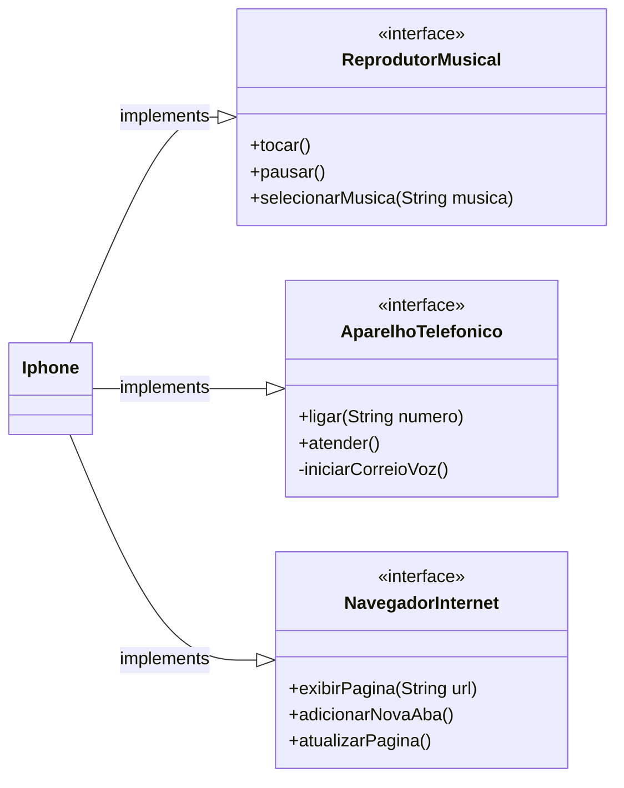

```mermaid
classDiagram
    direction LR
    
    class Iphone
    class ReprodutorMusical{
        <<interface>>
        +tocar()
        +pausar()
        +selecionarMusica(String musica)
    }
    class AparelhoTelefonico{
        <<interface>>
        +ligar(String numero)
        +atender()
        -iniciarCorreioVoz()
    }
    class NavegadorInternet{
        <<interface>>
        +exibirPagina(String url)
        +adicionarNovaAba()
        +atualizarPagina()
    }

    Iphone--|>ReprodutorMusical : implements
    Iphone--|>AparelhoTelefonico : implements
    Iphone--|>NavegadorInternet : implements
```
